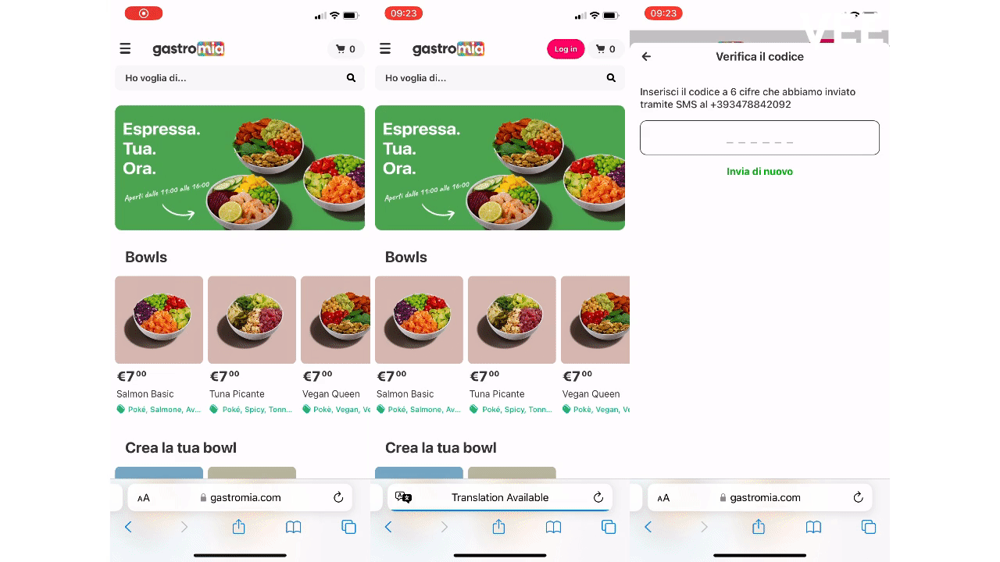

This repository is part of a wider online ordering and kitchen management system that powers the day-to-day operations of Gastromia – a food-tech startup that operates in the realm of ghost kitchens and virtual food brands. 

The core components that make up the system are:
- [web-gastromia](https://github.com/fredgrd/web-gastromia/) – Customer-facing mobile web-app
- [hub-gastromia](https://github.com/fredgrd/hub-gastromia/) – Internal dashboard (live orders, item editing, statistics)
- [api-gastromia](https://github.com/fredgrd/api-gastromia/) – Backend powering both web apps and connected services.

## What is web-gastromia?

Gastromia is a web app developed with mobile users in mind. Its primary goal is to provide our customers with a faster, smoother, and more streamlined checkout experience. We have optimized the app's user interface and functionality, enabling intuitive navigation, swift browsing, and effortless ordering. The app integrates with a range of services such as: 
- Facebook's Business Platform for Whatsapp driven order status notifications
- Stripe's secure card payment service. 
- Twilio's Verify SMS OTP.

These options were chosen to ensure a frictionless user experience while maintaining the time-to-market of the solution as short as possible.

## Tech Stack

Backend:

- Node.js
- Express
- AWS
- Mongoose
- Twilio Verify
- Stripe

Frontend:

- React
- React Router
- React Stripe (iframes for custom payment input)

Services:

- AWS S3 + CloudFront (Storage and delivery of media assets)
- Twilio Verify (OTP Authentication)
- Whatsapp Business Platform (Order updates)
- MongoDB Atlas (DB)

## Stages

### Search + Explore

### Card checkout + Refund

### Login + Logout

