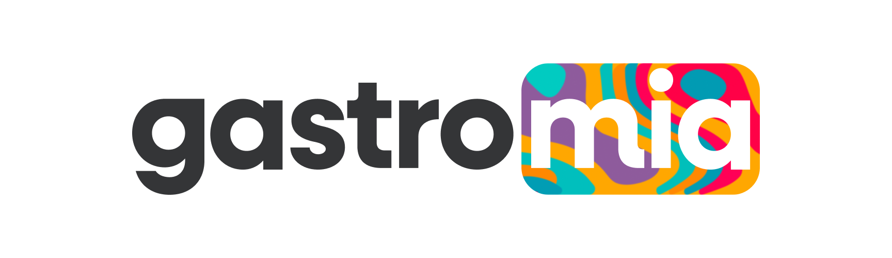
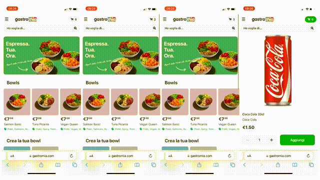
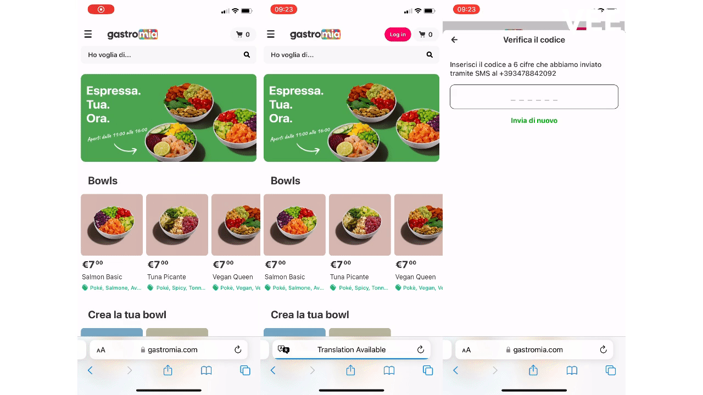

## What is Gastromia?

Gastromia is a web app developed with mobile use in mind to provide a faster and more streamlined checkout experience to our customers. 

This app is intented to support the day-to-day operations of Gastromia, a food-tech startup that manages a state-of-the-art ghost kitchen located in the center of Rome.

## Tech Stack

Backend:

- NodeJS
- Express
- AWS SDK
- Mongoose
- Twilio SDK
- Stripe SDK

Frontend:

- React
- React Router
- React Stripe (iframes for custom payment input)

Services:

- AWS S3 + CloudFront (Storage and delivery of media assets)
- Twilio Verify (OTP Authentication)
- Whatsapp Business Platform (Order updates)
- MongoDB Atlas (DB)

## Stages

### Search + Explore

### Card checkout + Refund

### Login + Logout

